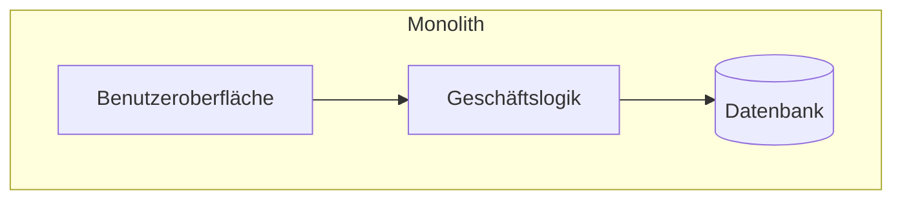
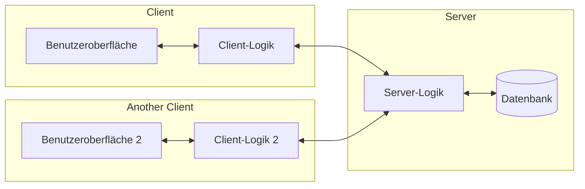
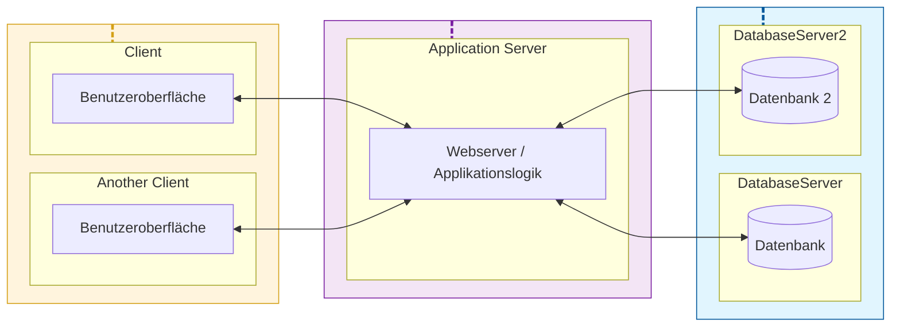
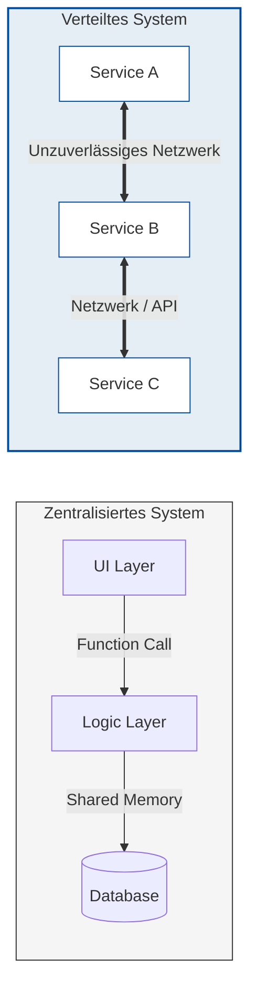
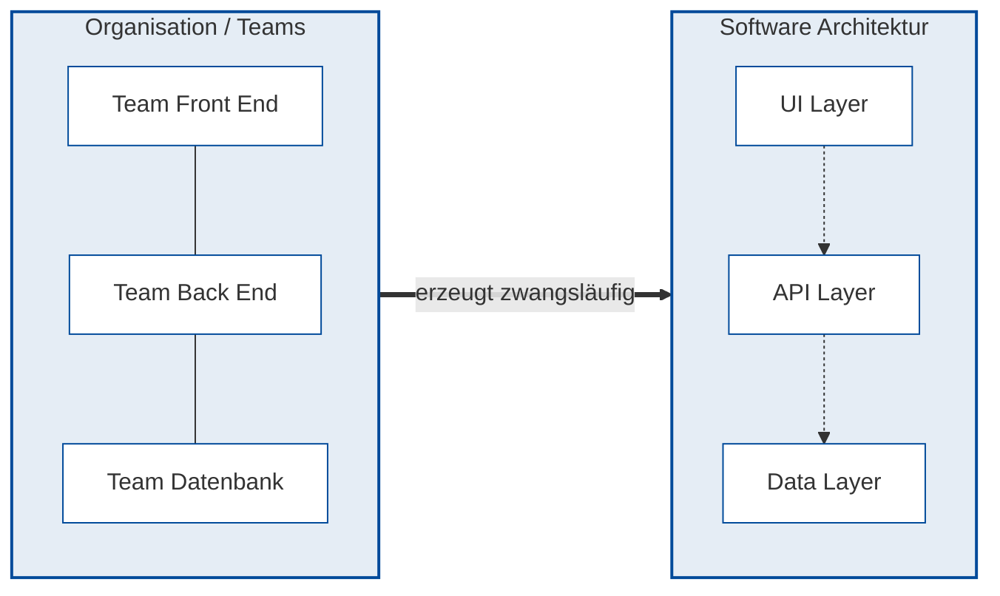
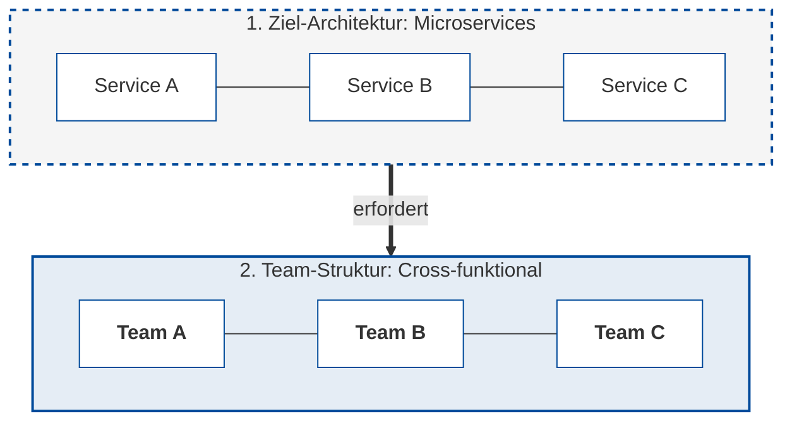
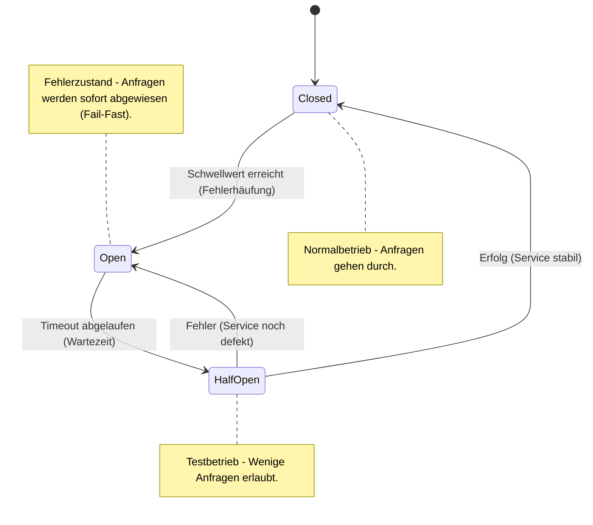

<!--

author: Volker G. Göhler

email:  volker.goehler@informatik.tu-freiberg.de

version: 0.0.1

language: de

narrator: Deutsch Male

edit: true
date: 2026
icon: img/TUBAF_Logo_EN_blau.png

logo: 
attribute: 

comment: Distributed Software

import: https://raw.githubusercontent.com/liaScript/mermaid_template/master/README.md

link: ./styles.css

title: Verteilte Software -- Architektur

tags: Lehre, TUBAF

-->

# Verteilte Software -- Architektur

**Distributed Software, 2026**

Volker Göhler, TU Bergakademie Freiberg

------------------------------

<!-- style="height:300px;" -->

> "Code" auf https://github.com/vgoehler/TUBAF_Distributed_Software als Open Educational Ressource.

----------------------------------------

## Grundlagen & klassische Architekturen

---

Lernziele

Nach dieser Vorlesung können Sie:

- erklären, was eine Softwarearchitektur ist
- verteilte von nicht-verteilten Systemen abgrenzen
- klassische Architekturformen benennen und vergleichen
- erste Architektur-Trade-offs diskutieren

---

### Was ist eine Softwarearchitektur?

    {{1}}

Eine Softwarearchitektur beschreibt:

- Komponenten
- deren Beziehungen
- grundlegende Designentscheidungen

   {{2}}
<!-- class="lia-callout--note" -->
>
> Architektur ist keine Implementierung, sondern Struktur und Verantwortung.

---

## Monolithische Architektur

Eigenschaften<!-- class="head" -->

- eine Codebasis
- ein Deployment
- direkte Funktionsaufrufe

<!-- class="lia-callout--note" -->
> Sehen Sie dabei Probleme?

### Charakteristika

<section class="flex-container">

Vorteile

<!-- class="arrow-list arrows-green" -->
- einfach zu verstehen
- leicht zu entwickeln
- einfache Tests

Nachteile

<!-- class="arrow-list arrows-red" -->
- schlecht skalierbar
- enge Kopplung
- Fehler wirken global
- schwierige Wartung

</section>

## Client–Server-Architektur

Idee<!-- class="head" -->

- Aufteilung in Client und Server
- klare Rollenverteilung
- zentrale Datenhaltung
- Kommunikation über Netzwerk
- standardisierte Schnittstellen

<!-- class="lia-callout--note" -->
> Wo finden wir solche Anwendungen?

### Charakteristika

<section class="flex-container">

Vorteile

<!-- class="arrow-list arrows-green" -->
- bessere Skalierbarkeit
- getrennte Verantwortlichkeiten
- einfachere Wartung
- unabhängige Entwicklung
- verteilte Nutzung
- zentrale Datenhaltung
- standardisierte Schnittstellen

Nachteile

<!-- class="arrow-list arrows-red" -->
- Netzwerklatenz
- erhöhter Entwicklungsaufwand
- komplexere Tests
- Sicherheitsaspekte
- mögliche Single Points of Failure

</section>

## 3-Tier-Architektur

Schichten<!-- class="head" -->

1. Präsentation
2. Applikationslogik
3. Persistenz

<!-- class="lia-callout--note" -->
> Was gewinnen wir dadurch?

### Charakteristika

<section class="flex-container">

Vorteile

<!-- class="arrow-list arrows-green" -->
- hohe Skalierbarkeit
- klare Trennung der Verantwortlichkeiten
- unabhängige Entwicklung
- erleichterte Wartung
- bessere Testbarkeit
- Wiederverwendbarkeit

Nachteile

<!-- class="arrow-list arrows-red" -->
- erhöhter Entwicklungsaufwand
- komplexere Tests
- Netzwerklatenz
- Sicherheitsaspekte
- mögliche Single Points of Failure
- erhöhter Ressourcenverbrauch

</section>

## Vergleich klassischer Architekturen
| Architektur | Skalierbarkeit | Wartbarkeit | Komplexität | Deployment |
| :--- | :--- | :--- | :--- | :--- |
| **Monolith** | **Vertikal** (limitiert auf eine Instanz) | **Erschwert** (durch starke Kopplung) | **Niedrig** (einheitliche Codebase) | Einfach (ein Artefakt) |
| **Client-Server** | **Moderat** (Lastverteilung möglich) | **Erhöht** (durch Logik-Trennung) | **Mittel** (Netzwerk-Kommunikation) | Synchronisationsaufwand |
| **3-Tier** | **Hoch** (Layer einzeln skalierbar) | **Gut** (Modular durch klare Schichten) | **Hoch** (Infrastruktur-Overhead) | Komplex (Multi-Stage Release) |

### Und warum ist das jetzt verteilt?

Der entscheidende Unterschied liegt nicht in der Anzahl der Server, sondern in der **Art der Kommunikation** und der **Fehlertoleranz**.

| Merkmal | Nicht-verteilt (Monolith / 3-Tier lokal) | Verteiltes System |
| :--- | :--- | :--- |
| **Adressraum** | Gemeinsamer Speicher (Shared Memory) | Getrennte Adressräume |
| **Kommunikation** | Lokaler Funktionsaufruf (In-process) | Netzwerk-Nachrichten (RPC, REST, Message) |
| **Fehlerfall** | „Alles oder nichts“ (Crash = System aus) | Partielle Ausfälle (Teilsysteme down) |
| **Zeit** | Gemeinsame Systemzeit | Keine globale Uhr (Uhrendrift) |

---

**Die Abgrenzung im Detail**<!-- class="head" -->

* **Monolith / 3-Tier (Klassisch):**

   - Meist eine logische Einheit.
   - Kommunikation zwischen Schichten erfolgt intern.
   - **Vertikale Skalierung:** „Größerer Server“.

* **Verteiltes System:**

   - Komponenten laufen auf unabhängigen Knoten.
   - Koordination ist zwingend erforderlich.
   - **Horizontale Skalierung:** „Mehr Server“.

---

**Visualisierung der Grenze**<!-- class="subhead" -->

Die goldene Regel:

Ein System ist genau dann verteilt, wenn der Ausfall eines Computers, von dem du noch nie gehört hast, deine eigene Arbeit unmöglich macht. (Leslie Lamport)

## Denkpause 💡

Welche Architektur würden sie für
ein Online-Prüfungssystem wählen? Und warum?

(2 Minuten Nachdenken, dann Diskussion)

## Soziotechnische Architektur & Organisation

Architektur ist kein Elfenbeinturm 🏛️

Softwarearchitektur wird oft als rein technisches Puzzle missverstanden. Doch Systeme werden von Menschen in Organisationen gebaut. In diesem Teil untersuchen wir, warum die Art und Weise, wie wir zusammenarbeiten, die Form unserer Software bestimmt.

<!-- class="lia-callout--note" -->
> **Leitsatz:**🗣️ Wer die Organisation ignoriert, verliert die Kontrolle über die Architektur.

### Architektur-Mythen & Fallstricke

* **Mythos:** „Das Diagramm ist die Architektur“
{{1}} 
**Realitätscheck:** Dokumentation $\neq$ Struktur. Architektur lebt im Code und in den tatsächlichen Schnittstellen.

* **Mythos:** „Viel hilft viel (Mehr Schichten = besser)“
{{2}}
**Realitätscheck:** Jede Schicht erzeugt Overhead, Komplexität und erhöht die kognitive Belastung für Entwickler.

* **Mythos:** „Performance ist immer das Wichtigste“
{{3}}
**Realitätscheck:** Wartbarkeit, Erweiterbarkeit und Time-to-Market sind oft geschäftskritischer als Millisekunden.

* **Mythos:** „Eine Architektur passt für alle Systeme“
{{4}}
**Realitätscheck:** *No Silver Bullet.* Jedes System benötigt ein individuell ausbalanciertes Trade-off-Profil.

* **Mythos:** „Architektur ist eine rein technische Entscheidung“
{{5}}
**Realitätscheck:** Architektur wird massiv von Budget, Zeitlinien und der Organisationsform beeinflusst.

* **Mythos:** „Unser Programmierer kann das schon irgendwie lösen“
{{6}}
**Realitätscheck:** Ohne Führung entsteht *Accidental Complexity*. Architektur muss aktiv und bewusst gestaltet werden.

{{7}}

**Take-away**<!-- class="head" -->

<!-- class="lia-callout--note" -->
> ⚖️ **Architektur ist das Management von Trade-offs.**
> Es ist die bewusste Entscheidung unter Unsicherheit, bei der man heute festlegt, was man morgen nur schwer ändern kann.

### Conway's Law

> „Organizations which design systems [...] are constrained to produce designs which are copies of the communication structures of these organizations.“ 
> — *Melvin Conway (1967)*

**Die Kernbotschaft:**
Die Struktur der Software spiegelt die Kommunikationswege des Teams wider. Wenn Teams nicht miteinander reden können, werden ihre Software-Module auch nicht sauber integriert sein.

### Das Inverse Conway Maneuver

> **„If you want your code to be modular, your teams must be modular.“**

Beim *Inverse Conway Maneuver* nutzt man die Organisation als Werkzeug für das Architekturdesign. Man formt die Kommunikationsstrukturen so, dass die gewünschte Architektur als „Pfad des geringsten Widerstands“ entsteht.

---

**Strategiewechsel**<!-- class="head" -->

| Ansatz | Fokus | Ziel |
| :--- | :--- | :--- |
| **Klassisch** | Bestehende Abteilungen | „Wir bauen, was unsere Struktur zulässt.“ |
| **Invers** | Gewünschte Architektur | „Wir bauen Teams, die diese Architektur erzwingen.“ |

---

**Visualisierung: Struktur folgt Architektur**<!-- class="subhead" -->

## Technische Resilienz in der Verteilung

Die Welt jenseits des Method Call 🌐

Sobald wir den geschützten Speicherbereich eines einzelnen Prozesses verlassen, ändert sich alles. Ein verteiltes System ist kein "großer Monolith auf mehreren Servern", sondern eine völlig neue Klasse von Herausforderung, bei der Unzuverlässigkeit der Standard ist.

<!-- class="lia-callout--note" -->
> **Leitsatz:** 🏗️ In einem verteilten System ist „Error Handling“ kein optionales Feature, sondern das eigentliche Design-Fundament.

### Die 8 Fallacies of Distributed Computing

Diese acht Annahmen sind **falsch**, werden aber oft unbewusst bei der Planung verteilter Systeme vorausgesetzt. Wer sie ignoriert, baut instabile Systeme.

1. **„Das Netzwerk ist zuverlässig“**
{{1}}
*Realität:* Pakete gehen verloren, Switches fallen aus, Kabel werden gezogen. Designen Sie für den Ausfall!

2. **„Die Latenzzeit ist Null“**
{{2}}
*Realität:* Lokale Aufrufe dauern Nanosekunden, Netzwerkaufrufe Millisekunden. Das summiert sich bei vielen Hops.

3. **„Die Bandbreite ist unendlich“**
{{3}}
*Realität:* Auch Gigabit-Leitungen stoßen an Grenzen, besonders bei Microservices-„Geschwätzigkeit“.

4. **„Das Netzwerk ist sicher“**
{{4}}
*Realität:* Gehen Sie davon aus, dass Daten mitgelesen oder manipuliert werden können (*Zero Trust*).

5. **„Die Topologie ändert sich nicht“**
{{5}}
*Realität:* Server kommen und gehen (Cloud!), IP-Adressen wechseln, Router werden neu konfiguriert.

6. **„Es gibt nur einen Administrator“**
{{6}}
*Realität:* Verschiedene Teams verwalten verschiedene Services. Man kann nicht einfach „kurz mal was am Server ändern“.

7. **„Transportkosten sind Null“**
{{7}}
*Realität:* Das Serialisieren von Objekten (JSON/XML) kostet CPU-Zeit und Geld (Cloud-Traffic!).

8. **„Das Netzwerk ist homogen“**
{{8}}
*Realität:* Verschiedene Betriebssysteme, Protokollversionen und Hardware müssen zusammenarbeiten.

---

**Die Konsequenz: Defensive Architektur**<!-- class="subhead" -->

Um diese Probleme zu lösen, brauchen wir spezifische Muster:

* **Timeouts & Retries:** Warten Sie nicht ewig auf eine Antwort.
* **Circuit Breakers:** Kappen Sie die Verbindung zu einem fehlerhaften Dienst, um Kaskadeneffekte zu vermeiden.
* **Idempotenz:** Stellen Sie sicher, dass mehrfache Aufrufe (bei Retries) keinen Schaden anrichten.

<!-- class="lia-callout--note" -->
> **Das größte Risiko:** Die Annahme, dass sich ein entfernter Service genau so verhält wie ein lokales Objekt im Speicher. Dieser Unterschied ist die Wurzel fast aller Performance- und Stabilitätsprobleme.
### Resilienz-Muster: Circuit Breaker

Wenn ein Service (Fallacy #1) unzuverlässig wird, darf der Aufrufer nicht ewig warten (Fallacy #2). Die Sicherung "springt heraus", um das System zu schützen.

**Die drei Zustände**<!-- class="head" -->

**Funktionsweise**<!-- class="subhead" -->

    {{1}}
- **Closed** (Geschlossen): Der Normalzustand. Der Circuit Breaker leitet alle Anfragen an den Ziel-Service weiter. Treten Fehler auf, zählt er diese.

    {{2}}
- **Open** (Offen): Wird eine Fehlerschwelle überschritten, öffnet die Sicherung. Alle weiteren Anfragen werden sofort mit einem Fehler beantwortet (Fail-Fast). Das entlastet den überforderten Ziel-Service.

    {{3}}
- **Half-Open** (Halboffen): Nach einer Wartezeit lässt die Sicherung eine begrenzte Anzahl an Test-Anfragen durch. Funktionieren diese, schließt sie sich wieder (Closed). Schlagen sie fehl, geht sie sofort zurück in den Zustand Open.

**Warum ist das wichtig?**<!-- class="subhead" -->

Ohne Circuit Breaker würden bei einem langsamen Service alle Threads des Aufrufers blockiert werden (Warten auf Timeout). Dies führt zum Thread Starvation und bringt letztlich den gesamten Monolithen oder das API-Gateway zum Absturz.

Kombination:

Nutzen Sie Circuit Breaker immer zusammen mit Timeouts. Der Timeout sagt: "Ich warte nicht länger", der Circuit Breaker sagt: "Ich versuche es erst gar nicht, da es sowieso gerade nicht klappt".

## The end slide

<!-- class="lia-callout--note" style="font-size:huge;" -->
> Vielen Dank für Ihre Aufmerksamkeit!
>
> <!-- style="width:400px;" -->

