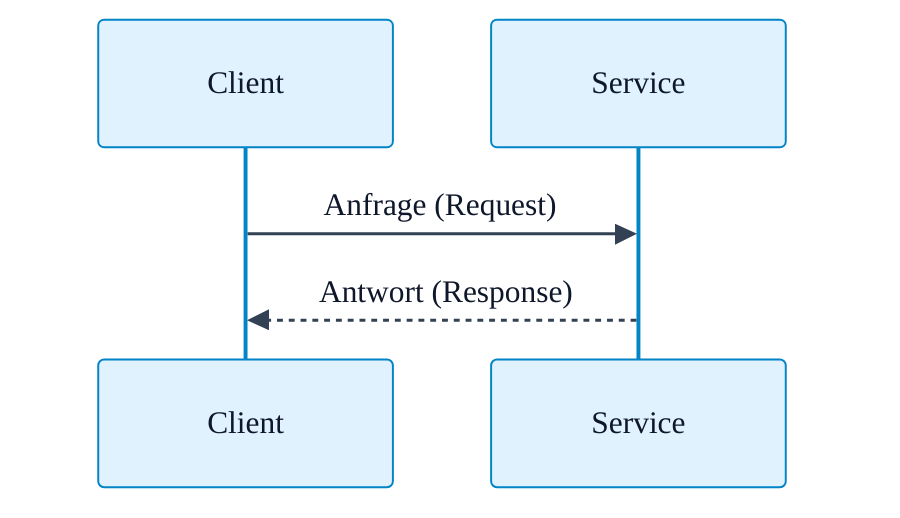
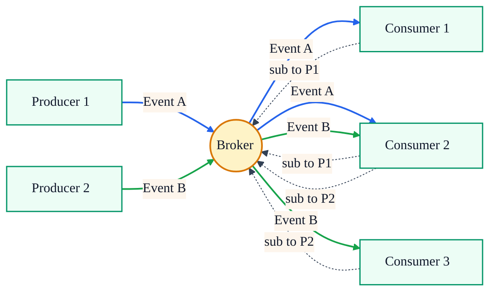

<!--

author: Volker G. Göhler

email:  volker.goehler@informatik.tu-freiberg.de

version: 0.0.1

language: de

narrator: Deutsch Male

edit: true
date: 2026
icon: img/TUBAF_Logo_EN_blau.png

logo: 
attribute: 

comment: Distributed Software

import: https://raw.githubusercontent.com/liaScript/mermaid_template/master/README.md

link: ./styles.css

title: Verteilte Software -- Architektur II

tags: Lehre, TUBAF

-->

# Verteilte Software -- Architektur II

**Distributed Software, 2026**

Volker Göhler, TU Bergakademie Freiberg

------------------------------

<!-- style="height:300px;" -->

> "Code" auf https://github.com/vgoehler/TUBAF_Distributed_Software als Open Educational Ressource.

----------------------------------------

## Retrospective zur letzten Vorlesung

- Was ist Ihnen **in Erinnerung geblieben**?
- Was war **unverständlich**?
- Welche **Fragen** sind offen geblieben?

----------------------------------------

## Services, Microservices & Events

<!-- class="head" -->
Lernziele

<!-- class="subhead" -->
Nach dieser Vorlesung können Sie:

- SOA, EDA und Microservices unterscheiden
- Kommunikationsmuster benennen
- Vorteile und Risiken moderner Architekturen benennen

<!-- class="subhead" -->
Portfolio

- Service-orientierte Architektur (SOA)
- Microservices
- Event-Driven Architecture (EDA)

### Expertenrunde

<!-- class="head" -->
In dieser Arbeitsphase:

- arbeiten Sie sich **vertieft** in eine Architektur ein,
- übernehmen Sie die Rolle von **Expert:innen**,
- und erklären diese Architektur später **verständlich und kritisch**.

<!-- class="lia-callout--note" -->
> ❗ Es geht **nicht** darum, eine Architektur zu „verkaufen“.

---

### Gruppen & Themen

<!-- class="subhead" -->
Sie arbeiten in **einer von drei Expertengruppen**:

- **Gruppe A:** Service-orientierte Architektur (SOA)
- **Gruppe B:** Microservices
- **Gruppe C:** Event-Driven Architecture (EDA)

👉 Ihre Gruppe vertritt **eine** Architektur.

---

<!-- class="head" -->
Ihre Rolle als Expert:innen

<!-- class="subhead" -->
Als Expert:innen sollen Sie:

- die **Grundidee** der Architektur erklären,
- typische **Einsatzszenarien** benennen,
- **Vorteile und Nachteile** abwägen,
- und Grenzen **offen ansprechen**.

<!-- class="lia-callout--note" -->
> **Ziele:**\
Sie selbst verstehen die Architektur tiefgehend.\
Andere Studierende sollen nach Ihrer Präsentation die Architektur **einordnen können**.

---

### Arbeitsanweisung

Gruppenarbeit\
4 Phasen (35 min) + Präsentation (15 min)

0. *Phase:* Gruppen finden
1. *Phase:* Lesen & Verstehen
2. *Phase:* Strukturieren
3. *Phase:* Vorbereitung der Präsentation

#### Phase 0: Gruppen finden

- Bilden Sie drei Gruppen mit **4-5 Personen**.
- Jede Gruppe wählt **eine** der drei Architekturen.
- Verschaffen Sie sich einen Überblick über das bereitgestellte Material.
- Verteilen Sie die Lektüreaufgaben.

⏱️ Richtwert: **5 Minuten**

---

#### Phase 1: Lesen & Verstehen

Bearbeiten Sie das bereitgestellte Material gemeinsam.

Achten Sie besonders auf:

- zentrale Begriffe
- typische Architekturannahmen
- wiederkehrende Probleme

⏱️ Richtwert: **10 Minuten**

---

#### Phase 2: Strukturieren

Diskutieren Sie in der Gruppe:

- Was ist die **Kernidee** der Architektur?
- Welches **Problem** soll sie lösen?
- Welche **neuen Probleme** entstehen?
- Für welche Systeme ist sie **ungeeignet**?

Notieren Sie Stichpunkte – keine langen Texte.

⏱️ Richtwert: **10 Minuten**

---

#### Phase 3: Vorbereitung der Präsentation

Bereiten Sie eine **Kurzpräsentation (2-5 Minuten)** vor.

Ihre Präsentation sollte:

- verständlich sein
- ohne unnötigen Fachjargon auskommen
- Stärken **und** Schwächen zeigen

Diagramme oder Skizzen sind erlaubt, aber optional.

⏱️ Richtwert: **10 Minuten**

---

<!-- class="head" -->
Leitstruktur für die Präsentation

Empfohlene Gliederung:

1. Grundidee der Architektur  
2. Typische Einsatzszenarien  
3. Vorteile  
4. Nachteile & Risiken  
5. Wann würden Sie diese Architektur **nicht** einsetzen?

<!-- class="subhead" -->
Wichtiger Hinweis ⚠️

- Es gibt **keine perfekte Architektur**
- Kritik ist ausdrücklich erwünscht
- „Modern“ ist **kein Argument**

---

#### Kurzüberblick

- **Phase 0 (5 min):** Gruppen bilden (4–5),\
**eine Architektur wählen**, Material sichten, Lektüre aufteilen  
- **Phase 1 (10 min):** Lesen & verstehen\
  → zentrale Begriffe, Annahmen, wiederkehrende Probleme
- **Phase 2 (10 min):** Strukturieren (Stichpunkte!)\
  → Kernidee, gelöstes Problem, neue Probleme, ungeeignet für welche Systeme?
- **Phase 3 (10 min):** Kurzpräsentation vorbereiten (**2–5 min**)\
  → verständlich, ohne Buzzwords, **Stärken & Schwächen**, Diagramme optional
- Präsentationen der Gruppen **(15 min)**

```mermaid @mermaid
gantt
  title Expertenrunde: Ablauf (35+15 Minuten)
  dateFormat  mm
  axisFormat  %M min

  section Gruppenarbeit
  Phase 0- Gruppen finden        :a0, 00, 05
  Phase 1- Lesen & Verstehen     :a1, after a0, 15
  Phase 2- Strukturieren         :a2, after a1, 25
  Phase 3- Präsentation vorbereiten :a3, after a2, 35

  section Präsentation (im Plenum)
  Kurzpräsentationen (2–5 min je Gruppe) :p1, after a3, 50
```

### Material

<!-- class="head" -->
A. Service-orientierte Architektur (SOA)

- https://en.wikipedia.org/wiki/Service-oriented_architecture
- https://martinfowler.com/bliki/ServiceOrientedAmbiguity.html
- https://www.ibm.com/think/topics/soa

<!-- class="head" -->
B. Microservices

- https://martinfowler.com/articles/microservices.html
- https://microservices.io/patterns/microservices.html
- https://en.wikipedia.org/wiki/Microservices

<!-- class="head" -->
C. Event-Driven Architecture (EDA)

- https://en.wikipedia.org/wiki/Event-driven_architecture
- https://www.ibm.com/think/topics/event-driven-architecture
- https://www.sap.com/germany/products/technology-platform/what-is-event-driven-architecture.html

<!-- class="head" -->
Alle als 📄 PDF

[alle obigen Artikel in der 🗂️ Nextcloud](https://ificloud.xsitepool.tu-freiberg.de/index.php/s/j6Gmcw4aCRZ2Tyd)

#### Service-orientierte Architektur (SOA)

<!-- class="head" -->
Grundidee

SOA strukturiert ein System als Sammlung fachlicher Services, die:

- klar definierte Schnittstellen haben
- über ein Netzwerk kommunizieren
- oft von verschiedenen Teams bereitgestellt werden
- Services sind größer geschnitten als Microservices.

Zentrale Merkmale

- lose Kopplung über Schnittstellen
- Fokus auf Geschäftsprozesse
- häufig zentrale Steuerung (z. B. Service Registry, Governance)

Annahmen der Architektur

- **stabile, gut definierte Schnittstellen** (Verträge werden eingehalten)
- **zentrale Governance** ist akzeptiert und durchsetzbar (Standards, Policies)
- Services sind **fachlich sinnvoll geschnitten** (nicht nur technisch)
- Betrieb/Integration ist organisatorisch **planbar** (Release-Prozesse, Change-Management)

<section class="flex-container">

Vorteile

<!-- class="arrow-list arrows-green" -->
- gute Wiederverwendbarkeit
- klare fachliche Struktur
- geeignet für große Organisationen

Nachteile

<!-- class="arrow-list arrows-red" -->
- oft schwergewichtig
- hoher organisatorischer Aufwand
- langsame Weiterentwicklung

</section>

<section class="flex-container">

Typische Einsatzszenarien

- Unternehmenssoftware
- Behörden-IT
- Integrationsplattformen
- Legacy-Systeme

Organisatorische Auswirkungen

- stärkere Rolle von **Architektur-/Governance-Gremien** (Standards, Review)
- **Abstimmungskosten** steigen (Schnittstellen, Versionierung, Integrationsregeln)
- Teams brauchen **klare Verantwortlichkeiten** für Services & Schnittstellen
- häufig mehr **Dokumentations- und Prozessdisziplin** (Contracts, SLAs)

</section>

Typische Fehlanwendungen / Anti-Patterns

- „SOA = ESB“: zu viel Logik im **Enterprise Service Bus** (ESB als Monolith)
- Services werden zu groß: **„Mega-Services“** statt modularer Schnittstellen
- zu frühe/zu harte Governance → **Entwicklung wird ausgebremst**
- „Shared Everything“: gemeinsame Datenbank trotz Services → **scheinbare Entkopplung**

---

#### Microservices

<!-- class="head" -->
Grundidee

Microservices zerlegen ein System in sehr kleine, autonome Services, die:

- unabhängig deploybar sind
- jeweils eine klar abgegrenzte Aufgabe erfüllen
- ihre eigenen Daten besitzen

Zentrale Merkmale

- dezentrale Datenhaltung
- unabhängige Technologieentscheidungen
- starke Teamautonomie

Annahmen der Architektur

- Teams haben **DevOps-Reife** (CI/CD, Monitoring, Incident-Handling)
- **Automatisierung** ist vorhanden (Deployments, Tests, Rollbacks)
- Services können **unabhängig deployt** werden (geringe Kopplung, klare Contracts)
- Datenhoheit ist geklärt: **jedes Service besitzt seine Daten**

<section class="flex-container">

Vorteile

<!-- class="arrow-list arrows-green" -->
- hohe Skalierbarkeit
- schnelle Weiterentwicklung
- gute Fehlerisolation

Nachteile

<!-- class="arrow-list arrows-red" -->
- hohe Komplexität
- schwieriges Debugging
- verteilte Fehlerbilder
- hoher Monitoring-Aufwand

</section>

<section class="flex-container">

Typische Einsatzszenarien

- große Webplattformen
- Systeme mit vielen parallelen Nutzern
- Organisationen mit vielen Teams

Organisatorische Auswirkungen

- Teams arbeiten **autonom**, brauchen aber klare **Ownership** pro Service
- mehr Aufwand für **Betrieb/Observability** (Tracing, Metrics, Logs)
- mehr Koordination bei **Schnittstellen-Versionierung** und API-Änderungen
- höhere Anforderungen an **Onboarding** (Systemverständnis verteilt)

</section>

Typische Fehlanwendungen / Anti-Patterns

- **„Distributed Monolith“**: Services sind so gekoppelt, dass sie nur gemeinsam deploybar sind
- zu feine Schnitte: **„Nanoservices“** → Overhead > Nutzen
- geteilte Datenbank / gemeinsames Schema → **Kopplung über Persistenz**
- fehlende Observability → Debugging wird **unpraktikabel**

#### Event Driven Architecture (EDA)

<!-- class="head" -->
Grundidee

Komponenten kommunizieren nicht direkt, sondern über Events:

- ein Service erzeugt ein Event
- andere Services reagieren darauf
- keine direkte Abhängigkeit zwischen Sender und Empfänger

Zentrale Merkmale

- asynchrone Kommunikation
- lose Kopplung
- hohe Reaktionsfähigkeit
- oft Event-Broker zwischengeschaltet
- Skalierbarkeit durch Entkopplung

Annahmen der Architektur

- Events sind **verlässlich zustellbar** oder Fehlerfälle sind eingeplant (Retries, Dead Letter Queue (DLQ))
- Konsistenz ist oft **nicht sofort**, sondern „eventuell“ akzeptabel
- Consumer sind **idempotent** (ein Event kann mehrfach ankommen)
- Event-Schemata sind **versionierbar** und werden gepflegt

<section class="flex-container">

Vorteile

<!-- class="arrow-list arrows-green" -->
- sehr gut skalierbar
- flexibel erweiterbar
- robust gegenüber Lastspitzen

Nachteile

<!-- class="arrow-list arrows-red" -->
- schwer nachvollziehbarer Kontrollfluss
- Debugging komplex
- Konsistenz nicht garantiert
- höherer Infrastrukturaufwand

</section>

<section class="flex-container">

Typische Einsatzszenarien

- Echtzeitsysteme
- Sensornetze
- Streaming- & Analyseplattformen

Organisatorische Auswirkungen

- Ownership: wer „besitzt“ ein Event? **Produzent** oder **Domäne** muss geklärt sein
- stärkere Notwendigkeit für **Schema-Governance** (Contracts, Evolution)
- Debugging/Analyse erfordert **Tooling** (Tracing, Correlation IDs, Replay)
- Teams müssen **asynchron denken** (Zeit, Reihenfolge, Nebenläufigkeit)

</section>

Typische Fehlanwendungen / Anti-Patterns

- „Event Spaghetti“: unkontrollierte Event-Flüsse ohne Domänenmodell
- Business-Logik verteilt sich unklar → **fehlender Kontrollfluss**
- fehlende Idempotenz/Ordering-Strategie → **Doppelausführungen / Inkonsistenzen**
- Events als Remote-Procedure-Call missbraucht → **Pseudo-Synchronität**

## Wrap-Up: Architekturvergleich

⚓ Vergleichsanker

- **SOA**: skaliert gut in großen Organisationen, wenn **Governance** funktioniert  
- **Microservices**: skaliert gut bei hoher Änderungsrate – erfordert **DevOps & Observability**  
- **EDA**: skaliert gut bei Entkopplung & Lastspitzen – erfordert **asynchrones Denken** und **Schema-Disziplin**

<section class="flex-container">

🎯 Wann passt es typischerweise?

<!-- class="arrow-list arrows-green" -->
- **SOA**: stabile Prozesse, Integration vieler Domänen/Teams  
- **Microservices**: viele Deployments, viele Teams, schnelle Iteration  
- **EDA**: viele Producer/Consumer, Echtzeit, Streams, Integrationen

⚖️ Womit bezahlt man?

<!-- class="arrow-list arrows-red" -->
- **SOA**: Prozess-/Governance-Overhead  
- **Microservices**: Betriebs- & Debugging-Komplexität  
- **EDA**: Nachvollziehbarkeit, Konsistenz, Debugging/Replay

</section>

<!-- class="lia-callout--note" style="width:auto;"-->
> Architekturentscheidungen lösen keine Probleme endgültig. Sie entscheiden, welche Probleme man akzeptiert.\
Gute Architektur ist daher kontextsensitiv und begründet.

### Kommunikation in verteilten Systemen

<section class="flex-container">

Synchron (Request/Response)

- einfach zu verstehen (klarer Kontrollfluss)
- blockierend (Warten auf Antwort)
- fehleranfällig (Timeouts, Retries, Kaskadeneffekte)

Asynchron (Event-Driven)

- lose Kopplung (zeitlich & technisch entkoppelt)
- skalierbar (Consumer parallelisierbar)
- komplex (Ordering, Duplikate, Observability)

</section>

Merke

- In synchronen Systemen hängt der Aufrufer direkt von der Erreichbarkeit und Antwortzeit des Gegenübers ab. **Timeouts** und **Retries** sind notwendig, können aber Kaskadeneffekte und Lastspitzen auslösen.
- In asynchronen Systemen ist nicht garantiert, wie oft ein Event zugestellt wird (**Delivery Semantics**). Deshalb müssen Consumer **idempotent** sein, damit Mehrfachzustellungen keinen Schaden verursachen.

### Weitere Begriffe

<!-- class="head" -->
**Dead Letter Queue (DLQ):**

Sammelstelle für Events, die nach mehreren Verarbeitungsversuchen **nicht erfolgreich verarbeitet werden konnten**.

Wichtig:

- Fehler werden **sichtbar**, ohne das System anzuhalten
- DLQs **lösen** Fehler nicht, aber sie machen sie **behandelbar**

---

<!-- class="head" -->
**Governance**

Regeln, die festlegen,

- **wer Entscheidungen trifft**
- **wie Änderungen koordiniert werden**
- **wer Verantwortung trägt**

Wichtig:

- Governance ist **Koordination**, nicht Kontrolle
- fehlende Governance skaliert schlecht
- zu strenge Governance bremst Innovation

---

<!-- class="head" -->
**Eventual Consistency**

Systeme sind nicht sofort, aber **irgendwann konsistent**.

Wichtig:

- Konsistenz ist ein **Trade-off**
- Zwischenzustände sind normal
- Nutzer:innen können Verzögerungen wahrnehmen

---

<!-- class="head" -->
**Loose Coupling (lose Kopplung)**

Eigenschaft eines Systems, bei der Komponenten  
**möglichst wenige Annahmen übereinander treffen**.

Wichtig:

- zentrales Ziel moderner Architekturen
- erhöht Flexibilität **und** Komplexität
- verschiebt Fehler in die Laufzeit

---

<!-- class="head" -->
**Service Boundary**

Klare Grenze, die festlegt,

- **welche Verantwortung ein Service hat**
- **welche Daten er besitzt**
- **wie er mit anderen kommuniziert**

Wichtig:

- schlechte Schnitte führen zu Kopplung
- Boundary-Fehler sind schwer korrigierbar

---

<!-- class="head" -->
**Distributed Monolith**

System mit vielen Services, die technisch verteilt sind,  
aber **logisch stark voneinander abhängen**.

Wichtig:

- häufige Fehlanwendung von Microservices
- kombiniert Komplexität mit geringer Flexibilität
- unabhängig deploybar ≠ unabhängig nutzbar

### Abschlussfrage

<!-- class="lia-callout--note" -->
> Warum ist Architektur in verteilten Systemen  
> immer eine **Kontextentscheidung**?

    {{1}}
<!-- class="lia-callout--note" style="font-size:huge;" -->
> Vielen Dank für Ihre Aufmerksamkeit!
>
> <!-- style="width:400px;" -->
