<!--

author: Volker G. Göhler

email:  volker.goehler@informatik.tu-freiberg.de

version: 0.0.1

language: de

narrator: Deutsch Male

edit: true
date: 2026
icon: img/TUBAF_Logo_EN_blau.png

logo: 
attribute: 

comment: Distributed Software

import: https://raw.githubusercontent.com/liaScript/mermaid_template/master/README.md

link: ./styles.css

title: Verteilte Software -- Architektur III

tags: Lehre, TUBAF

-->

# Verteilte Software -- Architektur III

**Distributed Software, 2026**

Volker Göhler, TU Bergakademie Freiberg

------------------------------

<!-- style="height:300px;" -->

> "Code" auf https://github.com/vgoehler/TUBAF_Distributed_Software als Open Educational Ressource.

----------------------------------------

## Rückblick

- Was ist Ihnen aus Architektur I und II besonders im Gedächtniss geblieben?
- Wo gab es Verständnisprobleme?
- Welche Fragen sind offen?

## Lernziele

Nach dieser Vorlesung können Sie:

- Qualitätsattribute systematisch bewerten
- Architektur-Trade-offs analysieren
- typische Lösungs- und Fehlmuster erkennen
- Architekturentscheidungen begründen

---

## Teil I – Qualität & Trade-offs

<!-- style="height:500px;" -->

### Qualitätseigenschaften

<!-- style="font-size:25pt; width:auto;" class="lia-callout--note" -->
> Welche Qualitätseigenschaften sind für verteilte Systeme besonders relevant?

### Architektur = Trade-off

<section class="flex-container">

Qualitätsattribute

**Betrieb**

- **Skalierbarkeit:** Lastbewältigung durch Ressourcenzugabe.
- **Verfügbarkeit:** Systemantwort ohne Fehlermeldung.
- **Konsistenz:** Alle Knoten sehen zur gleichen Zeit dieselben Daten.

**Entwicklung**

- Wartbarkeit
- Beobachtbarkeit
- Testbarkeit

**Sonstiges**

- Sicherheit

> ➡ Qualitätsziele stehen oft in Konkurrenz zueinander.

Beispielkonflikte

- **Starke Konsistenz ↔ Hohe Verfügbarkeit** (CAP)
- **Einfache Architektur ↔ Flexible Erweiterbarkeit**
- **Performance ↔ Fehlertoleranz** (Overhead durch Redundanz)
- **Schnelle Entwicklung ↔ Hohe Wartbarkeit** (VIBE coding)
- **Sicherheit** ↔ **Benutzerfreundlichkeit**

[CAP-Theorem](https://en.wikipedia.org/wiki/CAP_theorem)

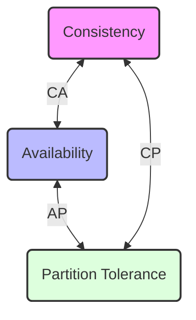

**Consistency** (Konsistenz): Jeder Lesevorgang erhält das Ergebnis des letzten Schreibvorgangs (oder einen Fehler).

**Availability** (Verfügbarkeit): Jede Anfrage erhält eine Antwort (keine Garantie, dass es die aktuellsten Daten sind).

**Partition Tolerance** (Partitionstoleranz): Das System arbeitet weiter, auch wenn Nachrichten zwischen Netzwerkknoten verloren gehen oder verzögert werden.

> **Wichtig:** In verteilten Systemen ist Partitionstoleranz (P) meist unverzichtbar. Der reale Trade-off findet daher fast immer zwischen C und A statt.

</section>

### Fehlertoleranz: "Design for Failure"

<section class="flex-container">

Strategien & Begriffe

- **Redundanz:** Bereitstellung zusätzlicher Ressourcen (Hardware/Software), die im Normalbetrieb nicht zwingend benötigt werden.
- **Replikation:** Spiegelung von Daten oder Zuständen auf mehrere Knoten, um Datenverlust vorzubeugen.
- **Failover:** Automatisches Umschalten auf ein Backup-System, sobald ein Fehler im Primärsystem erkannt wird.
- **Graceful Degradation:** Die Fähigkeit eines Systems, bei Teilausfällen Kernfunktionen aufrechtzuerhalten (eingeschränkter Betrieb statt Totalausfall).

> ➡ Ziel: **Fehler einplanen**, statt sie krampfhaft vermeiden zu wollen.

Visualisierung: Hochverfügbarkeit

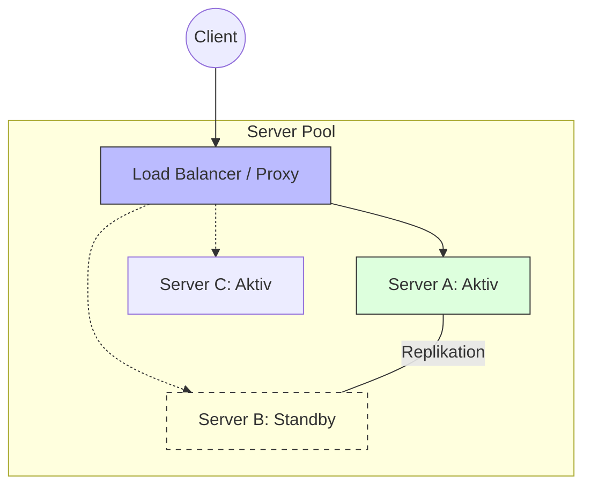
Mechanismen in der Praxis:

1. **Detection:** Health-Checks prüfen ständig die Vitalität der Server.
2. **Isolation:** Ein fehlerhafter Knoten wird sofort aus dem Verbund entfernt.
3. **Recovery:** Anfragen werden auf gesunde Knoten umgeleitet (Failover).

 
</section>

## Teil II – Architektur-Patterns

<section class="flex-container">

Was sind Patterns?

> **Wiederkehrende Lösungsstrategien für typische Architekturprobleme.**

Patterns sind keine starren Rezepte, sondern **Orientierungshilfen**, die bewährte Praktiken formalisieren.

Resilienz-Patterns

**1. Circuit Breaker (Sicherung)**\
**2. Bulkhead (Schotten)**

Stabilität & Performance

**3. Retry mit Backoff**\
**4. Caching & Read Replicas**

Daten & Skalierung

**5. Read Replicas**\
**6. Saga**

</section>

### Resilienz-Patterns

<!-- style="height:400px;" -->

#### Pattern: Circuit Breaker

> siehe auch Architektur I Vorlesung

<section class="flex-container">

Pattern: Circuit Breaker

**Konzept:** Eine "Sicherung", die bei zu vielen Fehlern die Verbindung zum Zielsystem kappt, um Ressourcen zu schonen.

- **Ziel:** Kaskadierende Fehler verhindern.
- **Zustände:** Geschlossen (OK), Offen (Fehler), Halboffen (Testlauf).

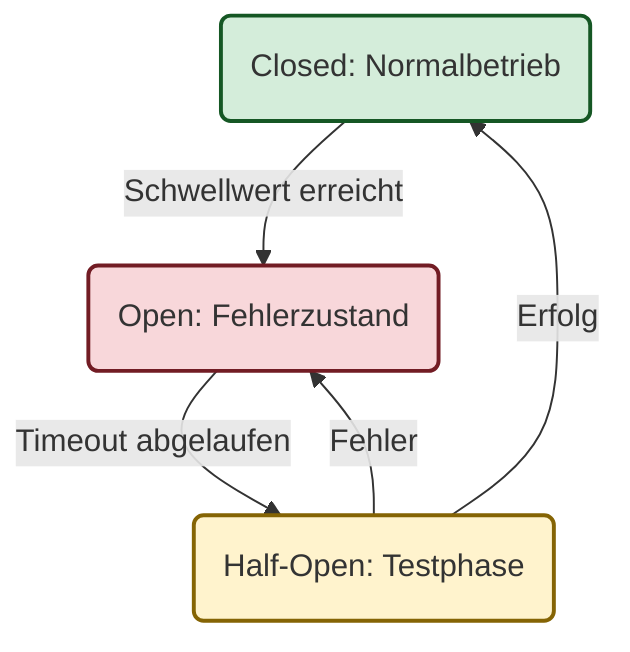

</section>

<!-- class="lia-callout--question" -->
> Wo könnte dieses Pattern in verteilten Systemen nützlich sein?

#### Pattern: Bulkhead

<section class="flex-container"> 

Pattern: Bulkhead

**Konzept:** Aufteilung von Ressourcen (z. B. Thread-Pools) in isolierte Bereiche. (Schotten im Schiffsbau)

- **Ziel:** Fehlercontainment.
- **Vorteil:** Wenn ein Pool (z. B. Suche) überlastet ist, bleibt der Rest (z. B. Checkout) funktionsfähig.

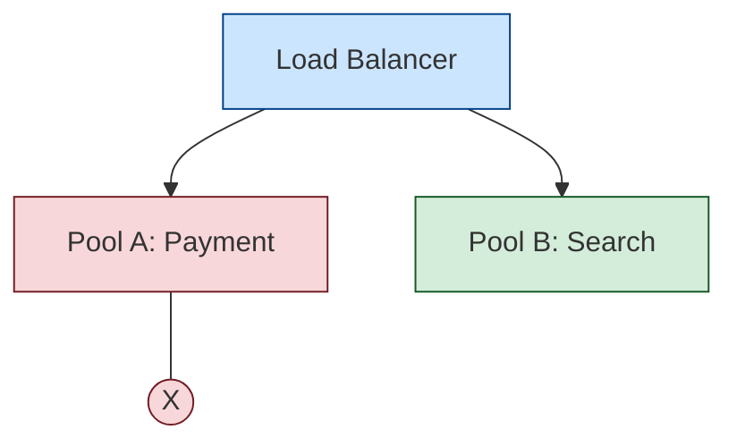

</section>

<!-- class="lia-callout--question" -->
> Wo könnte dieses Pattern in verteilten Systemen nützlich sein?

### Stabilitäts & Performance-Patterns

, Golden Gate Bridge -- 2022 -- 3023 (bw)” / CC BY-SA 4.0For print products: Dietmar Rabich / https://commons.wikimedia.org/wiki/File:San_Francisco_(CA,_USA),_Golden_Gate_Bridge_--_2022_--_3023_(bw).jpg")<!-- style="height:400px;" -->

#### Pattern: Retry mit Backoff

<section class="flex-container">

Pattern: Retry mit Backoff

**Konzept:** Automatisches Wiederholen fehlgeschlagener Operationen.

- **Exponential Backoff:** Die Wartezeit verdoppelt sich nach jedem Versuch.
- **Wichtig:** Nur bei transienten (vorübergehenden) Fehlern sinnvoll.

<!-- class="lia-callout--question" style="width:auto;"-->
> Wo könnte dieses Pattern in verteilten Systemen nützlich sein?

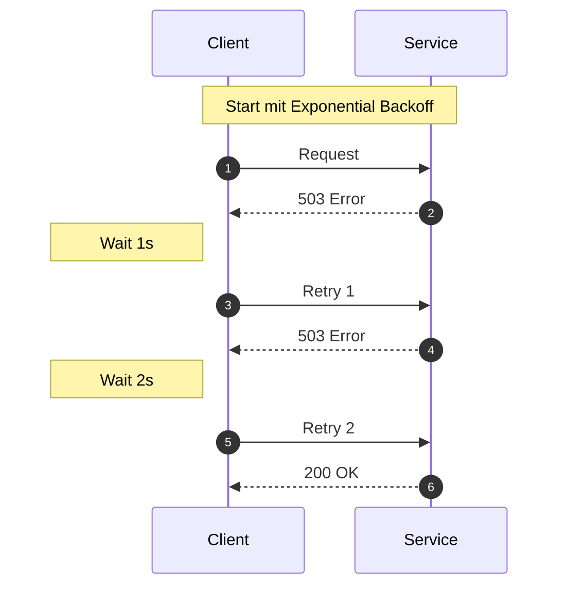

</section>

#### Pattern: Sidecar

<section class="flex-container">

Pattern: Sidecar

**Konzept:** Ein Hilfscontainer wird neben die Hauptanwendung gestellt, um Infrastruktur-Aufgaben zu übernehmen.

- **Aufgaben:** Logging, Monitoring, Retry-Logik, Security (mTLS).
- **Vorteil:** Die Applikationslogik bleibt sauber.

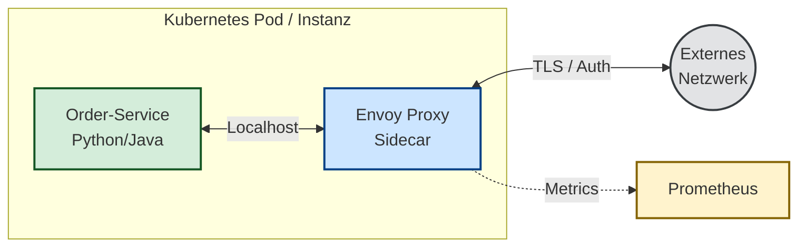

</section>

<!-- class="lia-callout--question" -->
> Wo könnte dieses Pattern in verteilten Systemen nützlich sein?

### Daten & Skalierung

<!-- style="height:400px;" -->

#### Pattern: Read Replicas

<section class="flex-container">

Pattern: Read Replicas

**Konzept:** Trennung von Schreib- (Primary) und Lesezugriffen (Replicas).

- **Vorteil:** Massive Skalierung der Leselast.
- **Trade-off:** Eventual Consistency (Daten auf Replicas hinken evtl. kurz hinterher).

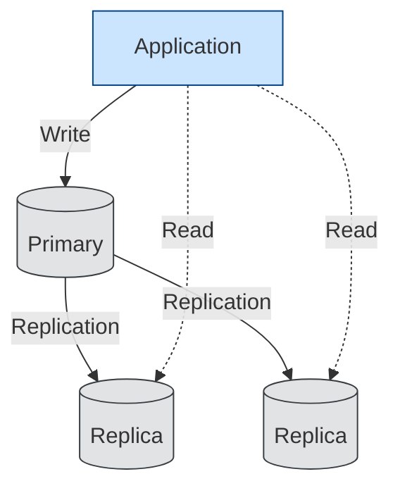

</section>

<!-- class="lia-callout--question" -->
> Wo könnte dieses Pattern in verteilten Systemen nützlich sein?

#### Pattern: Saga

<section class="flex-container">

Pattern: Saga

**Problem:** In Microservices gibt es keine "globale Datenbank-Transaktion".\
**Lösung:** Eine Saga führt eine Kette von lokalen Transaktionen aus.

* **Success:** Jeder Service schließt seine Aufgabe ab.
* **Failure:** Tritt ein Fehler auf, müssen alle vorherigen erfolgreichen Schritte durch **Kompensation** rückgängig gemacht werden (z. B. Storno).

> ➡ Ersetzt klassisches 2-Phase-Commit (2PC) in verteilten Systemen.

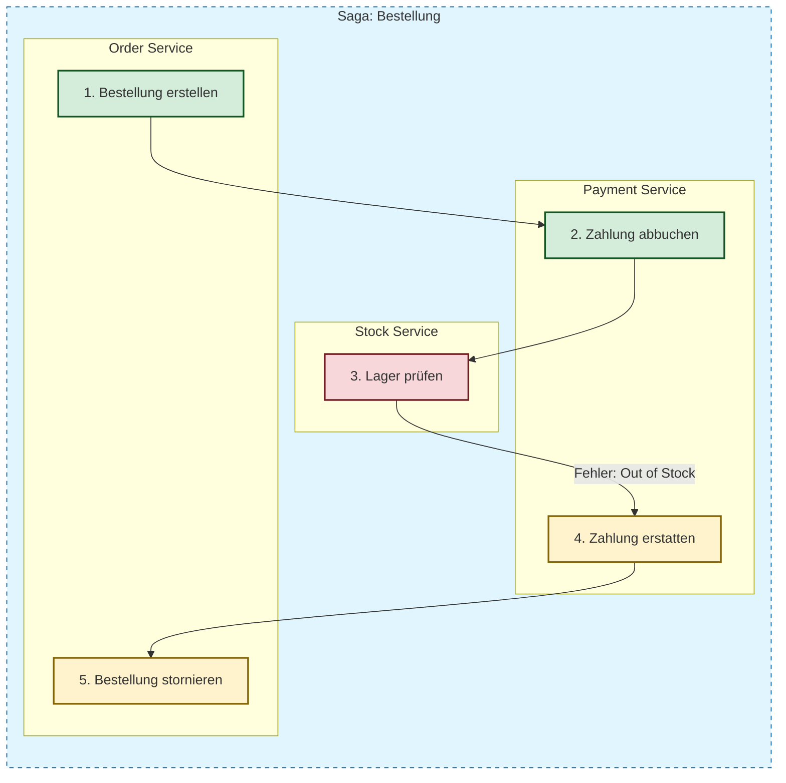

</section>

<!-- class="lia-callout--question" -->
> Wo könnte dieses Pattern in verteilten Systemen nützlich sein?

## Teil III – Anti-Patterns

<!-- style="height:400px;" -->

### Was sind Anti-Patterns?

<!-- class="lia-callout--note" style="width:auto;"-->
> **Häufige Fehlentwicklungen, die zunächst als Lösung erscheinen, aber langfristig hohen Schaden anrichten.**

Sie entstehen meist durch:

- Zeitdruck ("Quick & Dirty"), 
- fehlendes Domänenverständnis oder 
- technische Altlasten (technical debt).

### Anti-Pattern: Distributed Monolith

<section class="flex-container">

Anti-Pattern: Distributed Monolith

* **Problem:** Viele Services, die aber nur gemeinsam deployt werden können.
* **Symptom:** Eine Änderung in Service A erfordert zwingend Änderungen in B, C und D.
* **Folge:** Man hat die Komplexität von Microservices (Netzwerk-Overhead), aber die Unflexibilität eines Monolithen.

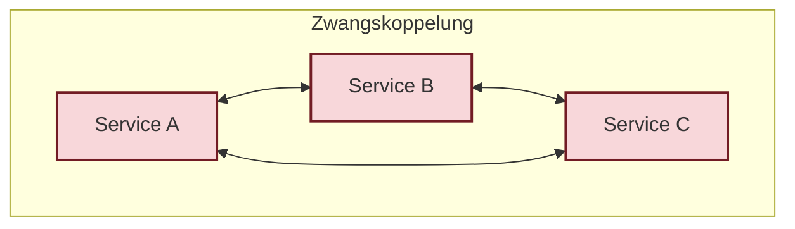

</section>

### Anti-Pattern: Shared Database

<section class="flex-container"> 

Anti-Pattern: Shared Database

- **Problem:** Mehrere Services teilen sich ein Datenbankschema.

- **Gefahr:** Ein Service ändert eine Spalte und bricht damit die Logik von drei anderen Services.

- **Besser:** Database per Service -> Zugriff nur über APIs.

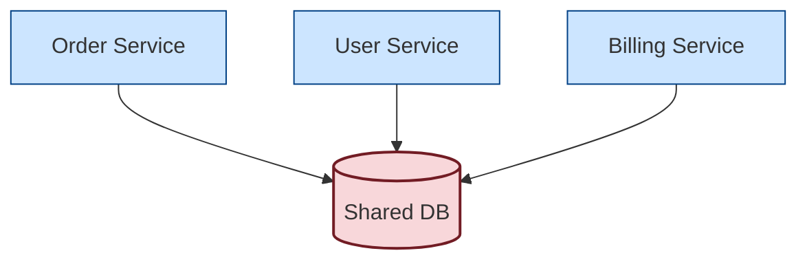

</section>

### Anti-Pattern: God Service / Brain Service

<section class="flex-container">

Anti-Pattern: God Service / Brain Service

- **Problem:** Ein Service übernimmt die gesamte Geschäftslogik; andere Services sind nur "dumme Datenspeicher".
- **Folge:** Single Point of Failure, massive Performance-Bottlenecks und schwerfällige Entwicklung.

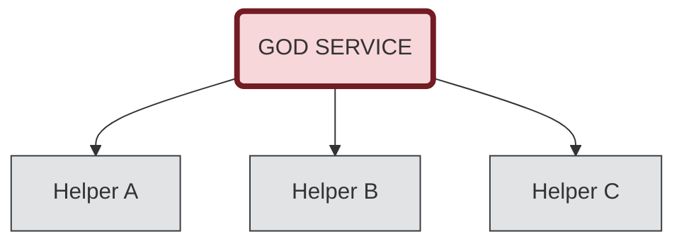

</section>

### Anti-Pattern: Event Spaghetti

<section class="flex-container">

Anti-Pattern: Event Spaghetti

- **Problem:** Unübersichtliche Ketten von Events ("A feuert Event, das B triggert, das C triggert, das wiederum A triggert").

- **Folge:** Niemand versteht mehr den Gesamtablauf; Debugging wird zum Albtraum.

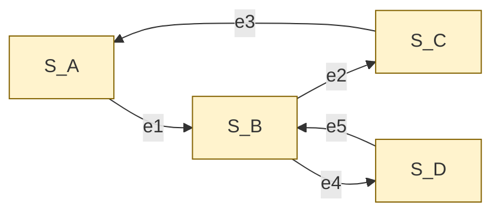

</section>

### Diskussionsfrage

<!-- class="lia-callout--question" -->
> Warum entstehen diese Anti-Patterns immer wieder?

## Teil IV – Architektur & Organisation

<!-- style="height:400px;" -->

### Conway’s Law

<section class="flex-container">

Conway’s Law

> **"Organisationen, die Systeme entwerfen, sind gezwungen, Entwürfe zu erstellen, die die Kommunikationsstrukturen dieser Organisationen kopieren."**

* **Silos:** Getrennte Abteilungen (Frontend, Backend, DB) führen oft zu schichtbasierten Monolithen.
* **Autonome Teams:** Cross-funktionale Teams fördern modulare Microservices.
* **Chaos:** Unklare Zuständigkeiten führen zu "Spaghetti-Architektur".

*Rückblick auf Vorlesung I*

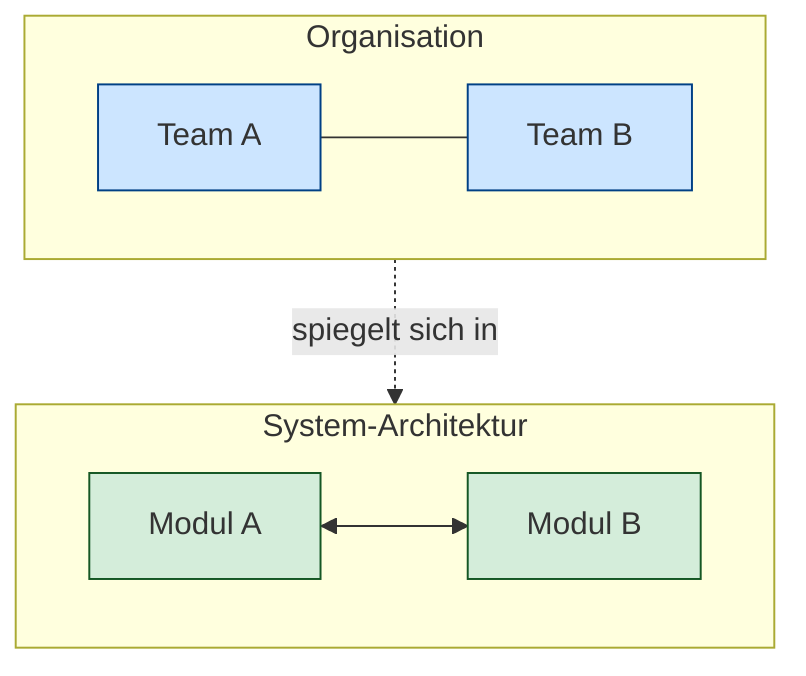

</section>

### Architektur für Betrieb & Teamarbeit

<section class="flex-container">

Betrieb & Teamarbeit

Architektur ist kein Elfenbeinturm. Viele Systeme scheitern nicht am Design, sondern am mangelnden Fokus auf den Betrieb ("Day 2 Operations").

- **Monitoring & Observability:** Wissen, was das System tut.
- **Incident Management:** Reagieren, wenn es brennt.
- **Deployment:** Automatisierung (CI/CD) statt manueller Angst-Releases.

> ➡ Architektur umfasst technische, organisatorische und kommunikative Entscheidungen.

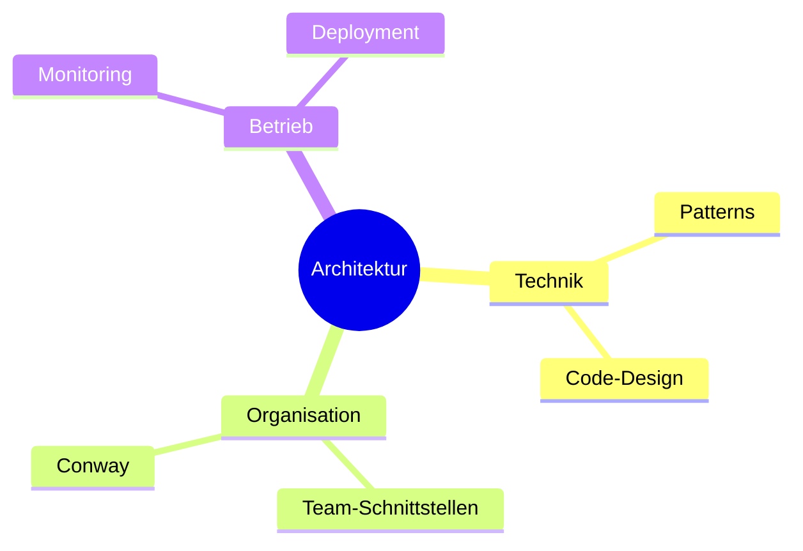

</section>

## Teil V – Entscheidungen treffen

<section class="flex-container">

Entscheidungen explizit machen

Gute Entscheidungen basieren auf Fakten, nicht auf Hypes. Sie müssen folgende Kriterien erfüllen:

- **Kontextabhängig:** Passt es zu unserem Problem?
- **Dokumentiert:** Warum haben wir uns so entschieden? (z.B. via Architecture Decision Records ([ADR](https://github.com/joelparkerhenderson/architecture-decision-record)))
- **Revidierbar:** Können wir die Entscheidung korrigieren, wenn sich Annahmen ändern?

**Anti-Muster:**

- "Weil es modern ist" (Hype-driven Development)
- "Weil es alle so machen" (Cargo-Cult)
- "Weil der Chef es will" (Autoritätsargument)
- "Weil es in der Schulung so war" (Schulungsgetrieben)
- "Weil es schnell geht" (Short-term Thinking)
- "Weil wir es schon immer so gemacht haben" (Status Quo Bias)

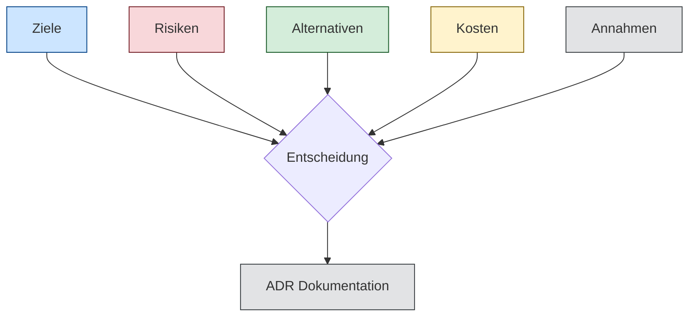

</section>

## Teil VI – Fallstudie: Architektur-Workshop

<!-- style="height:400px;" -->

### Das Szenario: "Campus-Connect"

<section class="flex-container">

Das Szenario: "Campus-Connect"

**Ein modernes Studierenden-Management-System für:**

* **Live-Interaktion:** Vorlesungen & Echtzeit-Chat.
* **Prüfungsbetrieb:** Notenverwaltung & Online-Prüfungen.
* **Content:** Asynchrone Inhalte (Video/Files) & AI-Lernhelfer.

---

**Die Eckdaten (Constraints):**

- **User:** 2.000 Studierende / 100 Lehrende.
- **Lastspitzen:** Extrem hoch während Prüfungsphasen.
- **Compliance:** Höchste Anforderungen an Datenschutz & Sicherheit.

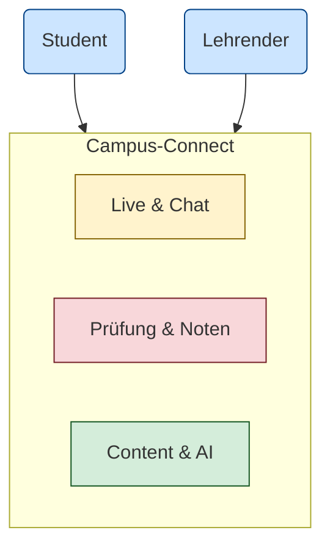

</section>

### Navigationshilfe: Architektur-Stile

Strukturierter Entscheidungsprozess (Attribute-Driven Design (ADD))

Gute Architektur entsteht nicht durch "Hype", sondern durch die Priorisierung von **Architectural Drivers** (Qualitätsattributen).

1.  **Szenarien definieren:** "Was passiert bei 2000 gleichzeitigen Logins?"
2.  **Attribute gewichten:** Ist uns *Verfügbarkeit* wichtiger als *Konsistenz*? (CAP-Trade-off)
3.  **Stil wählen:** Welcher Stil unterstützt unsere Top-Prioritäten nativ?

> **Quelle:** Inspiriert durch das [*Attribute-Driven Design (ADD)* Framework](https://www.sei.cmu.edu/library/attribute-driven-design-add-version-20/) des Software Engineering Institute (SEI).

<!-- class="head" -->
**Vergleichs-Matrix für die Fallstudie**

Nutzen Sie diese Matrix, um Ihre Wahl in der Gruppenarbeit zu begründen:
Diese sind aber nicht in Stein gemeißelt – es gibt viele Variationen und Hybrid-Ansätze.

| Architekturstil | Fokus (QA) | Bekannte Trade-offs | Beispiel in der Fallstudie |
| --- | --- | --- | --- |
| 3-Tier | Konsistenz (C) | Schwer horizontal skalierbar | Notenverwaltung |
| Microservices | Skalierbarkeit (P) | Hohe operative Komplexität | AI-Lernhelfer |
| Event-Driven | Performance (A) | Eventual Consistency | Live-Chat / Benachrichtigung |
| SOA | Integration | Latenz durch Enterprise Service Bus | Anbindung Altsystem (Verwaltung) |

Architekten-Tipp:

"Everything in software architecture is a trade-off."

Es ist völlig legitim, für verschiedene Module der Fallstudie verschiedene Stile zu wählen (Hybrid-Architektur).

### Arbeitsauftrag: Design & Diskurs

<section class="flex-container">

👨‍👩‍👧‍👦 Gruppenarbeit (3-4 Pers.)

**Entwerfen Sie eine tragfähige Architektur und klären Sie:**

1. **Architekturstil:** Monolith, Microservices oder Serverless? Oder was anderes?
2. **Kommunikation:** Synchron (REST/gRPC) vs. Asynchron (Events)?
3. **Daten:** Shared Database oder Database-per-Service?
4. **Resilienz:** Welche Patterns (Circuit Breaker, Bulkheads) schützen die Notenverwaltung? Wo brauchen wir noch Resilienz?

**Kernfrage:** Wie gehen Sie mit dem CAP-Theorem um, wenn das Netz während einer Prüfung instabil ist?

⚖️ Trade-off Analyse

**Kein Design ohne Opfer.** Diskutieren Sie bewusst:

- Was opfern Sie zugunsten der Sicherheit?
- Wo akzeptieren Sie Eventual Consistency?
- Was ist wichtiger: Schnelle Antwortzeiten im Chat oder 100% Datenintegrität bei den Noten?

**Präsentation (3 Min):**

- Fokus: Warum haben Sie sich so entschieden?
- Es gibt keine perfekte Lösung, nur begründete Entscheidungen.

</section>

## Teil VII – Abschluss

<section class="flex-container">

Typische Fehler und Fallstricke

- Over-Engineering
- Technik ohne Kontext
- Ignorieren der Organisation
- fehlende Dokumentation

Zentrale Erkenntnis

> Architektur ist keine Optimierung, sondern eine verantwortete Entscheidung.

</section>

<section class="flex-container">

<!-- class="head" -->
Abschluss

<!-- class="lia-callout--note" style="width:auto;" -->
> Jede Architektur kauft Vorteile mit neuen Problemen.
>
> Gute Entscheidungen erkennen diesen Tausch und treffen ihn bewusst.

<!-- style="height:400px;" -->

</section>
