<!--

author: Volker G. Göhler

email:  volker.goehler@informatik.tu-freiberg.de

version: 0.0.1

language: de

narrator: Deutsch Male

edit: true
date: 2026
icon: img/TUBAF_Logo_EN_blau.png

logo: 
attribute:

comment: Distributed Software

import: https://raw.githubusercontent.com/liaScript/mermaid_template/master/README.md

link: ./styles.css

title: Verteilte Software -- Architektur IV

tags: Lehre, TUBAF

-->

# Verteilte Software -- Architektur IV

**Distributed Software, 2026**

Volker Göhler, TU Bergakademie Freiberg

------------------------------

<!-- style="height:400px;" -->

> "Code" auf https://github.com/vgoehler/TUBAF_Distributed_Software als Open Educational Ressource.

----------------------------------------

## Reflektion & Rückblick

Bevor wir in die Fallstudie einsteigen, lassen wir die Kernkonzepte der letzten Wochen Revue passieren. Architektur in verteilten Systemen ist primär das Management von Komplexität und Unzuverlässigkeit.

<!-- class="head" -->
Kernkonzepte im Check

- **Trade-offs:** Warum gibt es keine "perfekte" Architektur?
- **Resilienz:** Was bedeutet "Design for Failure" in der Praxis?
- **Patterns vs. Anti-Patterns:** Erkennen wir die Fallen, in die wir oft tappen?

<!-- class="head" -->
Diskussion

- Was ist Ihnen aus den Vorlesungen besonders im Gedächtnis geblieben?
- Wo gab es die größten Aha-Momente bei den Architektur-Stilen (Monolith vs. Microservices)?
- Welche Fragen sind noch völlig offen?

## Bedingungen der mündlichen Prüfung

Die Prüfung in "Verteilte Software" ist ein Fachgespräch. Hier sind die Eckpunkte für Ihre Vorbereitung:

<!-- class="head" -->
1. **Dauer:** 30 Minuten
<!-- class="head" -->
2. **Terminvereinbarung:**

- Terminvereinbarung zur mündlichen Prüfung bitte per E-Mail an Prof. Jung mit Betreff `Prüfung VertSys`\
[jung@informatik.tu-freiberg.de](mailto:jung@informatik.tu-freiberg.de)
- gern auch mich ins CC setzen:\
[volker.goehler@informatik.tu-freiberg.de](volker.goehler@informatik.tu-freiberg.de)
- Bitte auch Studiengang und Matrikelnummer angeben

```mermaid @mermaid
---
config:
  logLevel: 'debug'
  theme: 'forest'
---
timeline
    title Offene Prüfungstermine Verteilte Software
    section WiSe 2025/26
    Februar : 27. Februar
    März-Block I : 02. März
                        : 05. März
                        : 06. März
    März-Block II : 09. März
                  : 10. März
                  : 11. März
                  : 12. März
                  : 13. März
    Monatswechsel-Block : 30. März
                        : 31. März
                        : 01. April
    section SoSe 2026
    April-Block : ???
```

- Bitte schlagen Sie mehrere mögliche Prüfungstermine vor, da die Teilnehmerzahl pro Tag limitiert ist.
- Die Prüfung findet im Büro von Prof. Jung statt, **HUM-109**
- Text ist auch im [Opal-Kurs](https://bildungsportal.sachsen.de/opal/auth/RepositoryEntry/18591973381/CourseNode/98504808034731) hinterlegt

### 3. Themen

- Geprüft werden sowohl die Inhalte der Vorlesung als auch die Inhalte der Übungen!
- Wir starten mit einer verteilten Architektur, die sie frei wählen können. Diskutieren Sie die Qualitätsattribute, die Architektur-Patterns und die Trade-offs, die Sie in diesem Szenario sehen.
- Dann folgen Fragen zu weiteren Architekturen, Patterns und Anti-Patterns, die wir in den Vorlesungen behandelt haben. Die "weichen" Themen wie Organisation, Betrieb und Entscheidungsfindung werden nicht abgefragt.
- Bei dem Kommunikations- und Parallelisierungsblock fragen wir nicht nach Implementierungsdetails, sondern nach den Konzepten und Prinzipien dahinter.
- n8n wird nicht geprüft, da es sich um ein Tool handelt, das wir als Beispiel für Low-Code/No-Code-Ansätze genutzt haben. Nutzen Sie die Übungen um sich mit Webhooks, REST und MCP vertraut zu machen.
- erwarten Sie Fragen zu MCP und KI mit Bezug zu Verteilten Systemen

## Fallstudie: Architektur-Workshop

<!-- style="height:400px;" -->

### Das Szenario: "Campus-Connect"

<section class="flex-container">

Das Szenario: "Campus-Connect"

**Ein modernes Studierenden-Management-System für:**

* **Live-Interaktion:** Vorlesungen & Echtzeit-Chat.
* **Prüfungsbetrieb:** Notenverwaltung & Online-Prüfungen.
* **Content:** Asynchrone Inhalte (Video/Files) & AI-Lernhelfer.

---

**Die Eckdaten (Constraints):**

- **User:** 2.000 Studierende / 100 Lehrende.
- **Lastspitzen:** Extrem hoch während Prüfungsphasen.
- **Compliance:** Höchste Anforderungen an Datenschutz & Sicherheit.

```mermaid @mermaid
graph TD
    S(Student):::primary
    L(Lehrender):::primary
    
    subgraph System [Campus-Connect]
        C1[Live & Chat]:::warning
        C2[Prüfung & Noten]:::danger
        C3[Content & AI]:::success
    end
    
    S & L --> System

    classDef primary fill:#CCE5FF,stroke:#004085;
    classDef success fill:#D4EDDA,stroke:#155724;
    classDef danger fill:#F8D7DA,stroke:#721C24;
    classDef warning fill:#FFF3CD,stroke:#856404;
```

</section>

Aufgabe

Entwerfen Sie eine tragfähige Architektur für "Campus-Connect" und diskutieren Sie die zentralen Trade-offs, die Sie dabei sehen.

### Navigationshilfe: Architektur-Stile

Strukturierter Entscheidungsprozess (Attribute-Driven Design (ADD))

Gute Architektur entsteht nicht durch "Hype", sondern durch die Priorisierung von **Architectural Drivers** (Qualitätsattributen).

1.  **Szenarien definieren:** "Was passiert bei 2000 gleichzeitigen Logins?"
2.  **Attribute gewichten:** Ist uns *Verfügbarkeit* wichtiger als *Konsistenz*? (CAP-Trade-off)
3.  **Stil wählen:** Welcher Stil unterstützt unsere Top-Prioritäten nativ?

> **Quelle:** Inspiriert durch das [*Attribute-Driven Design (ADD)* Framework](https://www.sei.cmu.edu/library/attribute-driven-design-add-version-20/) des Software Engineering Institute (SEI).

<!-- class="head" -->
**Vergleichs-Matrix für die Fallstudie**

Nutzen Sie diese Matrix, um Ihre Wahl in der Gruppenarbeit zu begründen:
Diese sind aber nicht in Stein gemeißelt – es gibt viele Variationen und Hybrid-Ansätze.

| Architekturstil | Fokus (QA) | Bekannte Trade-offs | Beispiel in der Fallstudie |
| --- | --- | --- | --- |
| 3-Tier | Konsistenz (C) | Schwer horizontal skalierbar | Notenverwaltung |
| Microservices | Skalierbarkeit (P) | Hohe operative Komplexität | AI-Lernhelfer |
| Event-Driven | Performance (A) | Eventual Consistency | Live-Chat / Benachrichtigung |
| SOA | Integration | Latenz durch Enterprise Service Bus | Anbindung Altsystem (Verwaltung) |

Architekten-Tipp:

"Everything in software architecture is a trade-off."

Es ist völlig legitim, für verschiedene Module der Fallstudie verschiedene Stile zu wählen (Hybrid-Architektur).

### Arbeitsauftrag: Design & Diskurs

👨‍👩‍👧‍👦 Gruppenarbeit

- 3-4 Personen pro Gruppe
- 25 Minuten Design-Phase

<section class="flex-container">

Aufgabe

**Entwerfen Sie eine tragfähige Architektur und klären Sie:**

1. **Architekturstil:** Monolith, Microservices oder Serverless? Oder was anderes/Hybrid?
2. **Kommunikation:** Synchron (REST/gRPC) vs. Asynchron (Events)?
3. **Daten:** Shared Database oder Database-per-Service?
4. **Resilienz:** Welche Patterns (Circuit Breaker, Bulkheads) schützen die Notenverwaltung? Wo brauchen wir noch Resilienz?

**Kernfragen:**

- Wie gehen Sie mit den Qualitätskriterien um?
- Welche sind für Sie am wichtigsten und wie beeinflussen sie Ihre Architektur?
- Wo liegen Single Points of Failure?
- Wie adressieren Sie diese?

⚖️ Trade-off Analyse

**Kein Design ohne Opfer.** Diskutieren Sie bewusst:

- Was opfern Sie zugunsten der Sicherheit?
- Wo akzeptieren Sie Eventual Consistency?
- Was ist wichtiger: Schnelle Antwortzeiten im Chat oder 100% Datenintegrität bei den Noten?

**Präsentation (5 Min):**

- Stellen Sie Ihre Architektur vor und begründen Sie Ihre Entscheidungen.
- Fokus: **Warum** haben Sie sich so entschieden?
- Es gibt keine perfekte Lösung, nur begründete Entscheidungen.

</section>

## Abschluss

<section class="flex-container">

Typische Fehler und Fallstricke

- kein Architekturstil (Ich implementiere einfach drauf los)
- Over-Engineering (Ich brauche 10 Services, obwohl 2 reichen würden)
- Technik ohne Kontext (Ich setze Kubernetes ein, obwohl es für 2000 Nutzer überdimensioniert ist)
- Ignorieren der Organisation (DevOps, Teamstruktur, Betrieb)
- fehlende Dokumentation (Architektur ist nicht nur Code, sondern auch Kommunikation)

Zentrale Erkenntnis

> Architektur ist keine Optimierung, sondern eine verantwortete Entscheidung.

</section>

<section class="flex-container">

<!-- class="head" -->
Abschluss

<!-- class="lia-callout--note" style="width:auto;" -->
> Jede Architektur kauft Vorteile mit neuen Problemen.
>
> Gute Entscheidungen erkennen diesen Tausch und treffen ihn bewusst.

<!-- style="height:400px;" -->

</section>
