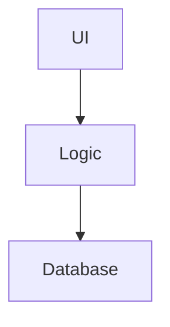
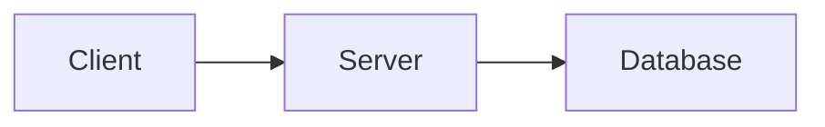
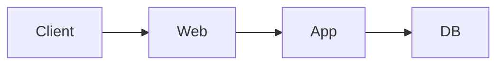

<!--

author: Volker G. Göhler

email:  volker.goehler@informatik.tu-freiberg.de

version: 0.0.1

language: de

narrator: Deutsch Male

edit: true
date: 2026
icon: img/TUBAF_Logo_EN_blau.png

logo: 
attribute: 

comment: Distributed Software

import: https://raw.githubusercontent.com/liaScript/mermaid_template/master/README.md

link: https://raw.githubusercontent.com/vgoehler/introduction-to-n8n/refs/heads/main/styles.css

title: Introduction to N8N Workflows 01

tags: Lehre, TUBAF

-->

# Verteilte Software -- Architektur

**Distributed Software, 2026**

Volker Göhler, TU Bergakademie Freiberg

------------------------------

<!-- style="height:300px;" -->

> "Code" auf https://raw.githubusercontent.com/vgoehler/TUBAF_Distributed_Software/refs/heads/main/vorlesung_1_architektur.md als Open Educational Ressource.

----------------------------------------

## Grundlagen & klassische Architekturen

---

## Lernziele
Nach dieser Vorlesung können Sie:
- erklären, was eine Softwarearchitektur ist
- verteilte von nicht-verteilten Systemen abgrenzen
- klassische Architekturformen benennen und vergleichen
- erste Architektur-Trade-offs diskutieren

---

## Was ist eine Softwarearchitektur?
Eine Softwarearchitektur beschreibt:
- Komponenten
- deren Beziehungen
- grundlegende Designentscheidungen

Architektur ist keine Implementierung, sondern Struktur und Verantwortung.

---

## Monolithische Architektur

### Eigenschaften

- eine Codebasis
- ein Deployment
- direkte Funktionsaufrufe

### Vorteile

- einfach zu verstehen
- leicht zu entwickeln

### Nachteile

- schlecht skalierbar
- enge Kopplung
- Fehler wirken global

## Client–Server-Architektur

### Idee

- klare Rollenverteilung
- zentrale Datenhaltung

### Typische Beispiele

- Webanwendungen
- Datenbanksysteme

## 3-Tier-Architektur

### Schichten

1. Präsentation
2. Applikationslogik
3. Persistenz

- ➡ bessere Wartbarkeit
- ➡ bessere Skalierung als Monolith

## Vergleich klassischer Architekturen

Architektur |	Skalierbarkeit	| Wartbarkeit	| Komplexität
--- |--- |--- |--- |
Monolith |	gering |	gering |	niedrig
Client-Server |	mittel |	mittel |	mittel
3-Tier |	besser |	besser |	höher

## Denkpause 💡

Welche Architektur würdet ihr für
ein Online-Prüfungssystem wählen – und warum?

(2 Minuten Nachdenken, dann Diskussion)

## Typische Denkfehler

- „Verteilt = automatisch skalierbar“
- „Architektur ist nur ein Diagramm“
- „Netzwerk ist zuverlässig“

## Take-away

Architektur ist eine bewusste Entscheidung unter Unsicherheit.

## Zusammenfassung

- n8n ist ein mächtiges Tool zur Automatisierung
- Visuelle Workflows erleichtern das Verständnis
- Debugging ist datengetrieben

<!-- style="font-size:huge;" -->
> Vielen Dank für Ihre Aufmerksamkeit!
>
> <!-- style="width:400px;" -->

